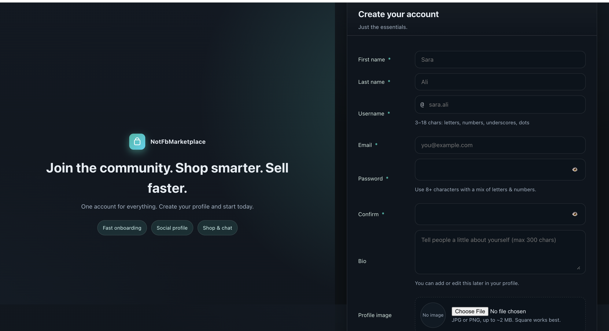
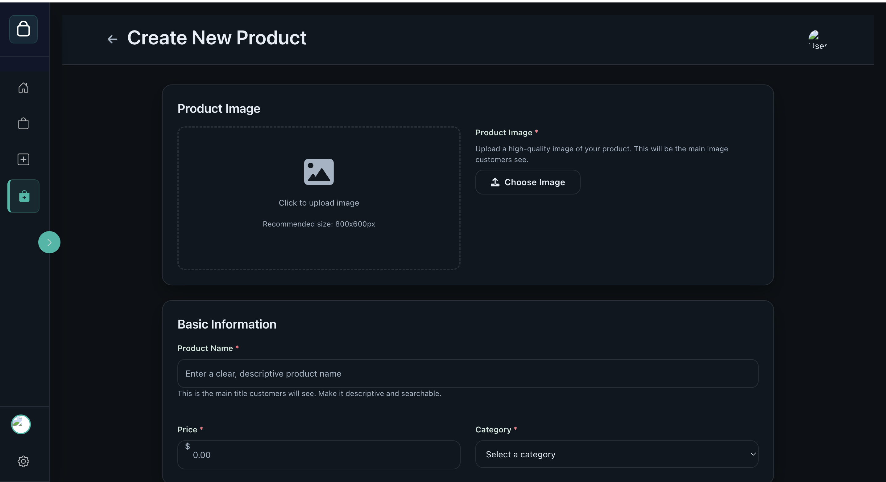
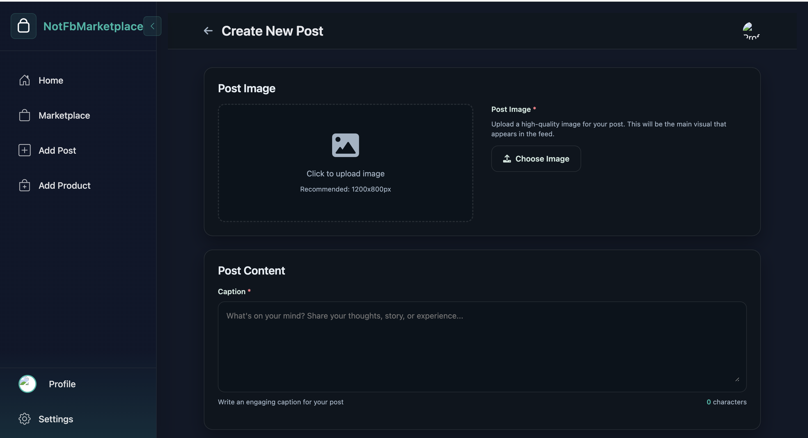
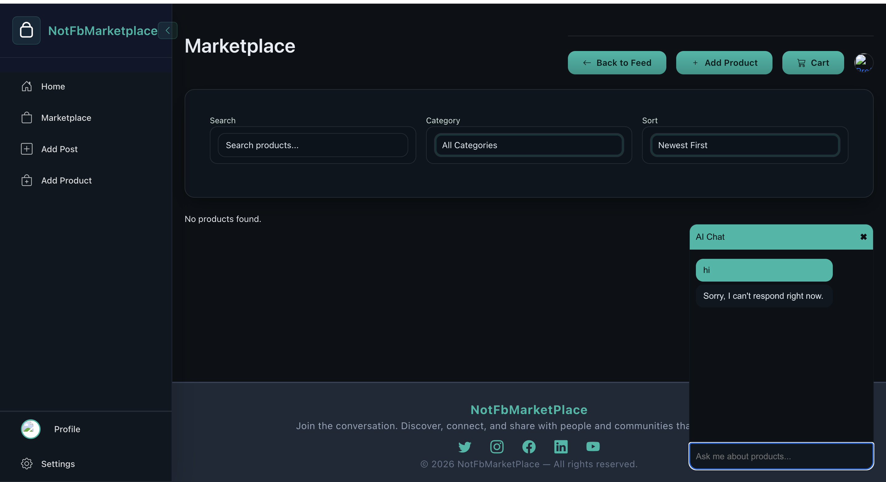
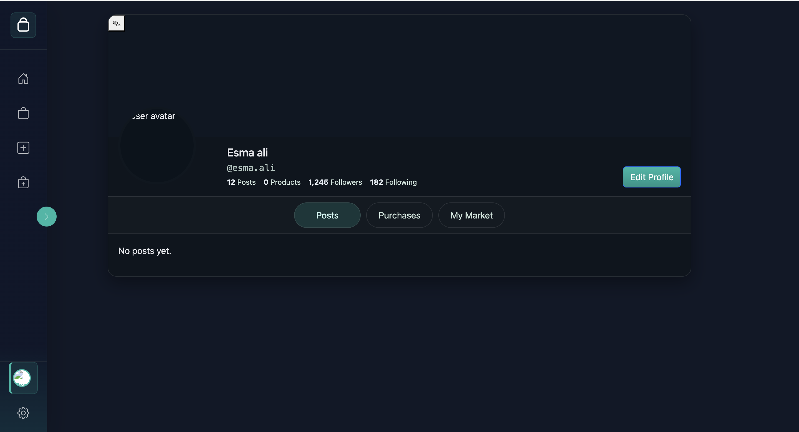
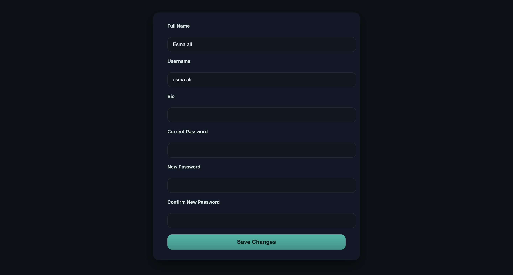

# Social Commerce Marketplace Platform

## Overview

Social Commerce Marketplace Platform is a Laravel-based full-stack web application that combines social networking features with an online marketplace experience.

The platform allows users to create accounts, manage profiles, publish posts, list products for sale, browse marketplace items, manage carts, and interact with an AI-powered product assistant.

This project was developed as an academic full-stack web application to practice Laravel development, authentication, database relationships, file uploads, marketplace workflows, and AI API integration.

---

## Features

### Authentication

- User registration
- User login
- Logout
- Forgot password
- Reset password

### User Profile

- View profile
- Edit profile information
- Update username and bio
- Change password
- Upload profile image
- View user posts
- View listed products
- View purchases and marketplace activity

### Social Feed

- View social feed
- Create new posts
- Upload post images
- Add post captions
- Display user-related content

### Product Marketplace

- Browse marketplace products
- Search products
- Filter products by category
- Sort products
- Create new product listings
- Upload product images
- Add product details
- Set price
- Select category
- Manage listed products

### Cart and Checkout

- Add products to cart
- View cart
- Manage cart items
- Checkout workflow
- Payment page interface

### AI Chat Assistant

- AI chat interface inside the marketplace
- Product-aware assistant concept
- Designed to help users ask about products and marketplace items

---

## Technologies Used

### Backend

- PHP
- Laravel
- Laravel Blade
- Eloquent ORM
- Laravel Authentication
- Laravel Migrations
- Laravel Validation
- Laravel Sessions

### Frontend

- HTML
- CSS
- JavaScript
- Tailwind CSS
- Alpine.js
- Blade Templates
- Vite

### Database

- SQLite / MySQL

### Tools

- Composer
- npm
- Vite
- Visual Studio Code

---

## Database Models

The project includes models and database structure for:

- Users
- Posts
- Products
- Cart
- Cart Items
- Orders
- Order Items

---

## Screenshots

### Login


### Register



### Create Product



### Create Post



### Marketplace



### Profile



### Edit Profile



---

## Installation

Clone the repository:

```bash
git clone https://github.com/yourusername/social-commerce-marketplace.git
cd social-commerce-marketplace